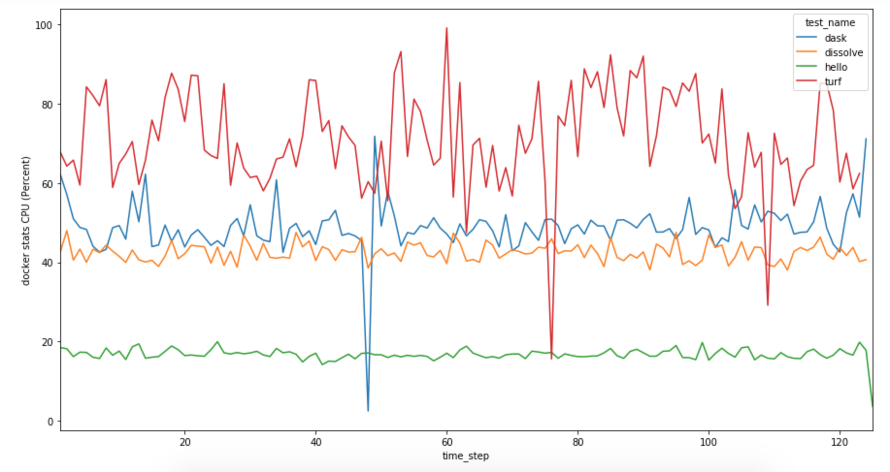

## gfw-geometry-ms-load-test

This is a very simplistic repo to try and understand the CPU required by various geometry calculations (and their microservices) when under load.

### Testing procedure

- Start the microservice using the usual shell script (./ps.sh, etc)
- Hit the microservice on it's own URL, do not go through the local gateway
- Use the loadtest module to submit 50 requests per second, with all 50 being run concurrently
- Run a total of 12,500 requests (just over 4 minutes for each test)
- Our main goal is to test the dissolve function; when required use the aoi.geojson as our input

To run the above, we used the npm loadtest module like so:

`loadtest -c 50 --rps 50 -n 12500 -m POST http://mymachine:5900/api/v1/test-gdal-dask/dissolve -p payload.json -T application/json`

### Scenarios Executed

1. [Hello only](https://github.com/gfw-api/python-skeleton-gdal-hello-only) (python) - this is the same debian-jessie container with conda installs as the poly-intersect microservice, but it runs a simple JSON (no geometric calculations) regardless of the input. 

2. [Dissolve](https://github.com/gfw-api/python-skeleton-gdal-dissolve) (python) - this is a much simplified version of the poly-intersect dissolve; it uses OGR's unary_union without any additional processing.

3. [Dask](https://github.com/gfw-api/python-skeleton-gdal-dask) (python) - this almost exactly mimics the poly-intersect service, processing using a DAG to describe OGR functions and processing it with dask.

4. [Turf](https://github.com/gfw-api/gfw-geostore-api/tree/temp/dissolve-test) (node) - this adds a little code to the existing gfw-geostore-api to use turf to union the input geometry. Useful because it performs the same dissolve function, but with node/javascript.

### Logging results

Results were logged by writing the output of `docker stats` to file:
`while true; do docker stats -a --no-stream | grep geostore >> stats.txt; done`

These logs were then filtered to select the container of interest. See the logs directory for actual results.

### Plotting

Logs for all microservices were aggregated into logs/results_raw.csv, and then time steps were added to each record (to ease in plotting) and written to logs/results.csv.

This CSV was loaded into the accompanying Jupyter Notebook and plotted.

### Results

While the validity of using `docker stats` to predict CPU used in the larger microservice pool is questionable, the results are as follows:

Next steps likely include a load test using the Turf dissolve microservice, which should help us understand if these high CPU conditions are unavoidable when dealing with geometry processing.

This also shows no real difference between the OGR dissolve and the dask-managed OGR dissolve. The hello microservice (no geometry calculation) is clearly the lightest. We can assume that other microservices that call other backend APIs will have a similar footprint.

